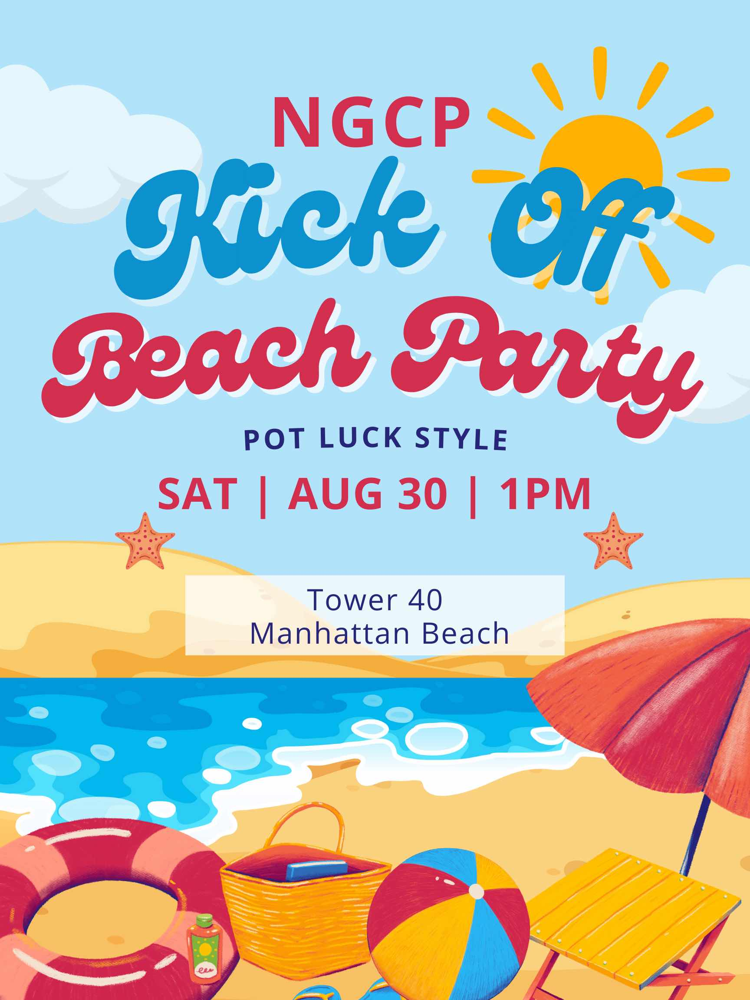
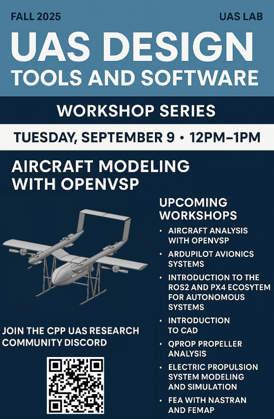

# NGCP Software Team – 2025-08-29

**Date:** August 29, 2025  
**Time:** 02:00–03:00  
**Location:** [Zoom](https://cpp.zoom.us/my/aimtiaz)  
**Meeting Type:** Weekly  
**Expected Duration:** 1 hour  
**Attendees:** Areesha Imtiaz, Ivan Trinh, Arun Nambiar, Edwin Estrada, Len Sakimuka, Medha Swarnachandrabalaji, Wesley Dam  

---

## 🧊 Icebreaker

- What’s your go-to study spot on campus?  

---

## 📢 Updates & Announcements

- Please complete and upload your **16 Personality Test** results by **August 28, 2025**  
- Make sure your **Discord display name** follows the format: *Full Name | Software Role*  
- Fill out your **Google Slides introduction** and **GitHub scrum updates** before today’s meeting  
- Keep an eye out: the **RFP release is expected in October**  
- Our **Friday meeting room** will remain Library Rm 5439 (unless noted otherwise)  

---

### 📌 Flyers & Events

**NGCP Kickoff Beach Party** – *Potluck Style*  
- **Saturday, Aug 30 | 1PM**  
- **Tower 40, Manhattan Beach**  

**Northrop Grumman Tech Talks – Fall 2025** (*Find Your Purpose Series*)  
- **Industrial Security** – Sept 8, 6PM EST / 3PM PST  
- **Avionics Integration & Software Engineering** – Sept 9, 6PM EST / 3PM PST  
- **Vehicle Engineering & Test & Evaluation** – Sept 10, 6PM EST / 3PM PST  
- **Product Support & Systems Engineering** – Sept 11, 6PM EST / 3PM PST  
[NGAS Tech Talks PDF](../images/ngas-tech-talks.pdf)

**CPP UAS Lab Workshop Series** – *UAS Design Tools & Software*  
- First session: **Aircraft Modeling with OpenVSP**  
- **Tuesday, Sept 9 | 12PM–1PM**  

---

## 🎯 Action Items

- [ ] Upload personality test results to OneDrive *(if not already completed)*  
- [ ] Update GitHub Project board before next meeting  
- [ ] Review GitHub workflow guide  

---

## 🧠 Discussion Topics

- [ ] RFP Status & Preparation  
- [ ] Possible Tech Stack / Software Architectures  
- [ ] Tooling: GitHub Workflow, IDEs, CI/CD  
- [ ] Questions or blockers  

---

## 📌 Decisions Made

- [ ] Confirmed GitHub Project (Kanban) setup  
- [ ] Meeting notes folder: `/docs/meetings/`  
- [ ] Members must complete Google slides intro and GitHub scrum before each meeting  

---

## 📅 Next Meeting

**Date & Time:** September 5, 2025 @ 02:00  
**Room:** Library Rm 5439  
**Pre-meeting task:** Review potential tech stack options and bring at least 1 suggestion  

---

## ✨ Notes & Side Comments

- [Presentation Link](https://docs.google.com/presentation/d/1Agzk9NxDMg9ONE8-3sUQFq6Kp19H5b1B4Kgiv__WXyU/edit?usp=sharing)

---

**Note-taker:** Areesha Imtiaz
